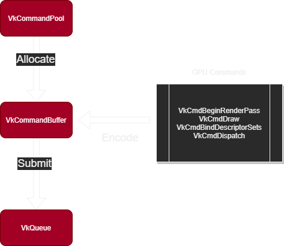
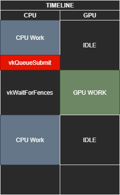

# Vulkan Intro

Vulkan is a graphics API. yea. I'm going through this intro to vulkan from [vkguide.dev](https://vkguide.dev/).

## Heres a list of some important objects:

- **VkInstance:** The Vulkan context, used to access drivers.

- **VkPhysicalDevice:** A GPU. Used to query physical GPU details (features, memory, size, etc).

- **VkDevice:**  "Logical" CPU context that you can actually exectute things on.

- **VkBuffer:** A chunk of GPU visible memory.

- **VkImage:** A texture you can read/write to

- **VkPipeline:** Holds the state of the GPU that you're using to draw (shaders, rasterization, options, depth settings, etc).

- **VkRenderPass:** Hold info about images you're rendering. All drawing commands must be done inside a VkRenderPass.

- **VkFrameBuffer:** Holds target images for VkRenderPass.

- **VkCommandBuffer:** Encodes GPU commands. All execution that is performed on GPU must be encoded in a VkCommandBuffer.

- **VkQueue:** Execution “port” for commands. GPUs will have a set of queues with different properties. Some allow only graphics commands, others only allow memory commands, etc. Command buffers are executed by submitting them into a queue, which will copy the rendering commands onto the GPU for execution.

- **VkDescriptorSet:** Holds binding info that connects shader inputs to data such as VkBuffer resources and VkImage textures. Think of it as a set of GPU-side pointers that bind once.

- **VkSwapchainKHR:** Holds the images for the screen. Allows you to render things into a visible window. the KHR suffix shows that it comes from an extension, which in this case is VK_KHR_swapchain.

- **VkSemaphore:** Synchronizes GPU to GPU execution of commands. Used for syncing multiple command buffer submissions one after another.

- **VkFence:** Synchronizes GPU to CPU execution of commands. Used to know if a command buffer has finished being exectured on the GPU.

---

## Heres some sudo code for a render-loop in vulkan:

```c++
// Ask the swapchain for the index of the swapchain image we can render onto
int image_index = request_image(mySwapchain);

// Create a new command buffer
VkCommandBuffer cmd = allocate_command_buffer();

// Initialize the command buffer
vkBeginCommandBuffer(cmd, ... );

// Start a new renderpass with the image index from swapchain as target to render onto
// Each framebuffer refers to a image in the swapchain
vkCmdBeginRenderPass(cmd, main_render_pass, framebuffers[image_index] );

// Rendering all objects
for(object in PassObjects){

    // Bind the shaders and configuration used to render the object
    vkCmdBindPipeline(cmd, object.pipeline);
    
    // Bind the vertex and index buffers for rendering the object
    vkCmdBindVertexBuffers(cmd, object.VertexBuffer,...);
    vkCmdBindIndexBuffer(cmd, object.IndexBuffer,...);

    // Bind the descriptor sets for the object (shader inputs)
    vkCmdBindDescriptorSets(cmd, object.textureDescriptorSet);
    vkCmdBindDescriptorSets(cmd, object.parametersDescriptorSet);

    // Execute drawing
    vkCmdDraw(cmd,...);
}

// Finalize the render pass and command buffer
vkCmdEndRenderPass(cmd);
vkEndCommandBuffer(cmd);


// Submit the command buffer to begin execution on GPU
vkQueueSubmit(graphicsQueue, cmd, ...);

// Display the image we just rendered on the screen
// renderSemaphore makes sure the image isn't presented until `cmd` is finished executing
vkQueuePresent(graphicsQueue, renderSemaphore);
```

## Swapchain present modes

- **VK_PRESENT_MODE_IMMEDIATE_KHR:** Makes the swapchain not wait for anything, and accept instant pushing of images. This will likely result in tearing, generally not recommended.

- **VK_PRESENT_MODE_FIFO_KHR:** This will have a queue of images to present on refresh intervals. Once the queue is full the application will have to wait until the queue is popped by displaying the image. This is the “strong VSync” present mode, and it will lock your application to the FPS of your screen.

- **VK_PRESENT_MODE_FIFO_RELAXED_KHR:** Mostly the same as Fifo VSync, but the VSync is adaptive. If the FPS of your application are lower than the optimal FPS of the screen, it will push the images immediately, likely resulting in tearing. For example, if your screen is a 60 HZ screen, and you are rendering at 55 HZ, this will not drop to the next vsync interval, making your general FPS drop to 30 like Fifo does, instead it will just display the images as still 55 FPS, but with tearing.

- **VK_PRESENT_MODE_MAILBOX_KHR:** This one has a list of images, and while one of them is being displayed by the screen, you will be continuously rendering to the others in the list. Whenever it’s time to display an image, it will select the most recent one. This is the one you use if you want Triple-buffering without hard vsync.

**Note:** VK_PRESENT_MODE_IMMEDIATE_KHR is rarely used due to its tearing. Only in extreme low latency scenarios it might be useful to allow the tearing. On real applications that have some work to do, MAILBOX is the preferred mode by default.

A **VkImage** is a handle to the actual image object to use as texture or to render into. A **VkImageView** is a wrapper for that image. It allows to do things like swap the colors.



The general flow to execute commands is:
-   You allocate a **VkCommandBuffer** from a **VkCommandPool**
-   You record commands into the command buffer, using **VkCmdXXXXX** functions.
-   You submit the command buffer into a **VkQueue**, which starts executing the commands.

---

## Renderpass

The image life will go something like this:
UNDEFINED -> RenderPass Begins -> Subpass 0 begins (Transition to Attachment Optimal) -> Subpass 0 renders -> Subpass 0 ends -> Renderpass Ends (Transitions to Present Source)

**VkFence** is used for GPU -> CPU communication. Pretty much a callback that the GPU can call to let the CPU know it finished something.



**VkSemaphore** is used for GPU -> GPU sync. There are two types of semaphores,
- Signal
	- The operation will immediately "lock" said semaphore when it exectures, and unlock once it finishes execution.
- Wait
	- The operation will wait until that semaphore is unlocked to begin execution.

Pseudocode example:
```c++
VkSemaphore Task1Semaphore;
VkSemaphore Task2Semaphore;

VkOperationInfo OpAlphaInfo;
// Operation Alpha will signal the semaphore 1
OpAlphaInfo.signalSemaphore = Task1Semaphore;

VkDoSomething(OpAlphaInfo);

VkOperationInfo OpBetaInfo;

// Operation Beta signals semaphore 2, and waits on semaphore 1
OpBetaInfo.signalSemaphore = Task2Semaphore;
OpBetaInfo.waitSemaphore = Task1Semaphore;

VkDoSomething(OpBetaInfo);

VkOperationInfo OpGammaInfo;
//Operation gamma waits on semaphore 2
OpGammaInfo.waitSemaphore = Task2Semaphore;

VkDoSomething(OpGammaInfo);
```

The execution order of the GPU-side commands will be Alpha->Beta->Gamma . Operation Beta will not start until Alpha has fully finished its execution. If you don’t use semaphores in this case, the commands of the 3 operations might execute in parallel, interleaved with each other.